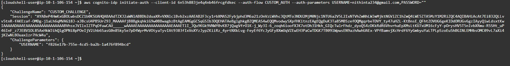
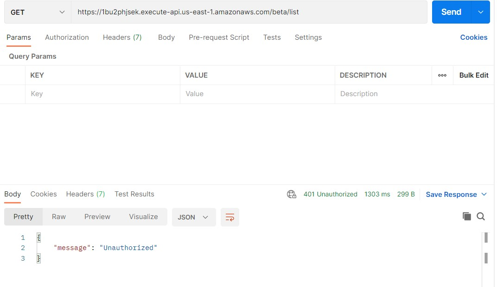

# Todo APP With AWS Backend

The whole project has two parts
```
* COGNITO SIGN UP
* API
```
## Cognito Sign 
 *this was done using the aws cli*

 Cognito signup was used to generate an otp for user registration 

 1. The signup part
 
 2. The sign in part
 
 3. otp to email

 

 4. access token
 

*Using this token we call the api*

## API

1. when You call the api without access_token



* GET request
    * The get output is sorted based on their date
    * then they are displayed based on the importance 
    * so that most important titles comes first followed by the unimportan ones
    >CURL Statement:
    
    ```https://1bu2phjsek.execute-api.us-east-1.amazonaws.com/beta/list```

    

* POST request
    * here new data is inserted 
    * title gives the title of what to do
    * description defines the detail of title
    * importance can be set to one(true) or zero(false) to show if the entry is importan
    >CURL Statement:
    
    ```https://1bu2phjsek.execute-api.us-east-1.amazonaws.com/beta/list?title=clean&description=clean the house up&importance=1```

    

* DELETE request
    >CURL Statement:

    * give the title of data to be deleted to the remove parameter
    
    ```https://1bu2phjsek.execute-api.us-east-1.amazonaws.com/beta/list?remove=clean```

    

* PATCH request
    >CURL Statement:

    * give the title of data to be updated to update parameter
    * give the new data to parameter title,importance,description to be updated

    
    ```https://1bu2phjsek.execute-api.us-east-1.amazonaws.com/beta/list?update=netflix&title=netflix and chill```

    

# Final Output After All the Curl Statements

```
{
    "pay": {
        "title": "pay",
        "description": "google pay the dividn",
        "importance": "1",
        "date": "2021-11-26 16:22:18.421000"
    },
    "learn and study": {
        "title": "learn and study",
        "description": "study for maths exam",
        "importance": "1",
        "date": "2021-11-26 10:20:41.950000"
    },
    "netflix and chill": {
        "title": "netflix and chill",
        "description": "watch netflix",
        "importance": "0",
        "date": "2021-11-26 16:29:29.783000"
    },
    "play and sing": {
        "title": "play and sing",
        "description": "play with hairh",
        "importance": "0",
        "date": "2021-11-26 10:19:42.450000"
    }
}

```


